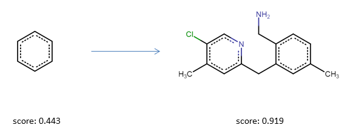
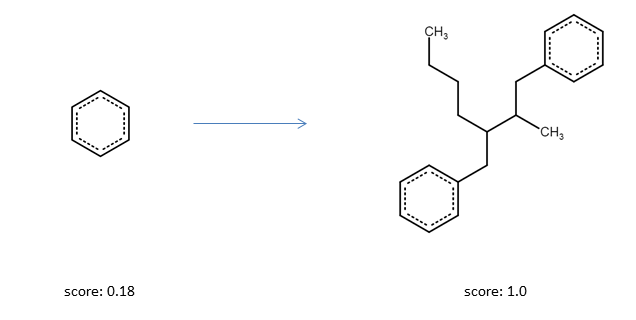
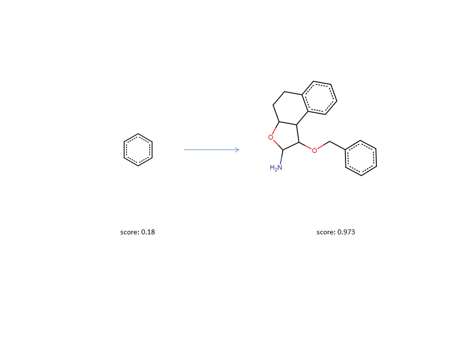

# Molecular Swarm Optimization (MSO)

Implementation of the method proposed in the paper "Efficient Multi-Objective Molecular Optimization in a Continuous Latent Space" by Robin Winter, Floriane Montanari, Andreas Steffen, Hans Briem, Frank Noé and Djork-Arné Clevert.<sup>1</sup>

### Dependencies
- [cddd](https://github.com/jrwnter/cddd)

### Installing
```
python setup.py install
```
### Getting Started
As a first simple experiment we will optimize a query molecule with respect to the drug likeness score (QED Bickerton et al.). We will start the optimization from a simple benzene molecule which has a QED score of 0.31.
```python
from mso.optimizer import BasePSOptimizer
from mso.objectives.scoring import ScoringFunction
from mso.objectives.mol_functions import qed_score
from cddd.inference import InferenceModel
infer_model = InferenceModel() # The CDDD inference model used to encode/decode molecular SMILES strings to/from the CDDD space
init_smiles = "c1ccccc1" # SMILES representation of benzene
scoring_functions = [ScoringFunction(func=qed_score, name="qed", is_mol_func=True)] # wrap the drug likeness score inside a scoring function instance
```
After loading some packages and defning the inference model, starting point and the objective functoin for the optimization we can create an instance of the Particle Swarm Optimizer with only one swarm and 100 particles.
```python
opt = BasePSOptimizer.from_query(
    init_smiles=init_smiles,
    num_part=200,
    num_swarms=1,
    inference_model=infer_model,
    scoring_functions=scoring_functions)
```
Now we can just run the optimization for a few steps.
```python
opt.run(20)
```
The best results are summarized in opt.best_solutions. The optimization history (best solution in each step and swarm) is summarized in opt.best_fitness_history. Most of the time, the optimizer should be able to find a solution with a score higher than 0.8 already after a few steps.
<br/>

<br/>

### Desirability Scaling
Often, it is not the goal to maximize a function as much as possible but to keep a molecular property within a certain range. To account for this, the ScoringFunction class can rescale the output of an objective function with respect to a desirability curve. To demonstrate this property, we optimize here the number of heavy atoms in a molecule. We would like to generate molecules that have a certain number (or range) of heavy atoms.  In this case generated molecules should have between 20 and 25 heavy atoms.  To achieve this, we define a desirability curve that has its peak in this range and assigns lower scores below and above:
```python
from mso.objectives.mol_functions import heavy_atom_count
hac_desirability = [{"x": 0, "y": 0}, {"x": 5, "y": 0.1}, {"x": 15, "y": 0.9}, {"x": 20, "y": 1.0}, {"x": 25, "y": 1.0}, {"x": 30, "y": 0.9,}, {"x": 40, "y": 0.1}, {"x": 45, "y": 0.0}]
scoring_functions = [ScoringFunction(heavy_atom_count, "hac", desirability=hac_desirability, is_mol_func=True)]
```
The resulting curve looks like this:
<br/>

<br/>
And indeed, running the optimizer for a few steps results in a molecules with the optimal amound of heavy atoms.
<br/>

<br/>
### Multi-Objective Optimization
To optimize multiple objective functions at the same time, they can simple append to the same list.
```python
scoring_functions = [ScoringFunction(heavy_atom_count, "hac", desirability=hac_desirability, is_mol_func=True), ScoringFunction(qed_score, "qed", is_mol_func=True)]
```
Optionally, an individual weight can be assigned to each scoring function to balance their importance.
<br/>

<br/> 
### References
[1] Chemical Science, 2019, DOI: 10.1039/C9SC01928F https://pubs.rsc.org/en/content/articlelanding/2019/SC/C9SC01928F#!divAbstract

